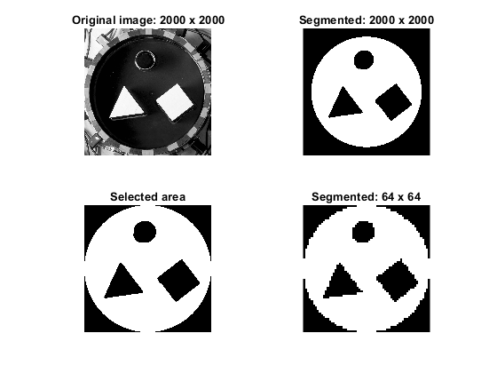

</head><body>
<h2>Contents</h2>
<ul><li><a href="#1">Electrical impedance tomography dataset: Segmentation</a></li><li><a href="#2">Creating a logical image of the tank: original size</a></li><li><a href="#3">Reading original images</a></li><li><a href="#4">Segmentation</a></li><li><a href="#5">Resizing the results</a></li><li><a href="#6">Visualization</a></li></ul>
<h2 id="1">Electrical impedance tomography dataset: Segmentation</h2><pre class="codeinput">%Targets inside a circular 2D tank
% For more information:
% https://fips.fi/open-datasets/eit-datasets/2d-electrical-impedance-tomography-dataset/

%This is just an approximation.
%The original photos present parallax, non-uniform illumination and
%slightly different camera positions for each case
%This code does not correct this errors.

close all
clear
clc
</pre><h2 id="2">Creating a logical image of the tank: original size</h2>
Based on <a href="https://matlab.fandom.com/wiki/FAQ#How_do_I_create_a_circle.3F">https://matlab.fandom.com/wiki/FAQ#How_do_I_create_a_circle.3F</a>
<pre class="codeinput">%Image parameters
imageSizeX = 2000; %works for square images
imageSizeY = 2000;
[columnsInImage, rowsInImage] = meshgrid(1:imageSizeX, 1:imageSizeY);

% Circle parameters.
centerX = 1000;
centerY = 1000;
radius = 870; %This is an approximation

%Calculating circle points
circlePixels = (rowsInImage - centerY).^2 + (columnsInImage - centerX).^2 &lt;= radius.^2;

%Converting from logical to double and displaying
vq = double(circlePixels);
</pre><h2 id="3">Reading original images</h2>
Downloaded from: <a href="https://zenodo.org/records/1203914">https://zenodo.org/records/1203914</a>
<pre class="codeinput">% Works for the cases without foam: 1-5, 7
data1 = 5;
data2 = 1;
string = "fantom_" + data1 + "_" + data2 + ".jpg";

v2 = imread(string); %read image
v2 = imresize(v2, [2000, 2000]); %not all images are 2000 x 2000

v2 = double(im2gray(v2));
v = mat2gray(v2); %Convert to gray scale

seg_I = vq.*v; % Set to zero the pixels outside the tank
seg_I = im2double(seg_I);
</pre><h2 id="4">Segmentation</h2><pre class="codeinput">thresh = graythresh(seg_I); %Otsu's method for binary segmentation
seg_I = double(imbinarize(seg_I,thresh));

seg_I=medfilt2(seg_I,[5,5]); %median filter to remove small artifacts

seg_fill = imfill(seg_I, 'holes'); %(morphological filtering) Opening, because the conductive targets are rings

%Close and opening to remove small artifacts
se = strel('disk',15);
seg_I_closed = imclose(seg_fill,se); %
J = imopen(seg_I_closed,se);

% Second Otsu's segmentation
thresh2 = graythresh(J);

J = imbinarize(J,thresh2);

% J(J&gt;thresh2) = 1;
% J(J&lt;thresh2) = 0;
% J(J==thresh2) = 1;
</pre><h2 id="5">Resizing the results</h2><pre class="codeinput">%New image parameters
imageSizeX2 = 64;
imageSizeY2 = 64;

segmented3 = vq + J; %tank and targets masks
segmented3( ~any(segmented3,2), : ) = [];  %Remove the rows with zeros
segmented3( :, ~any(segmented3,1) ) = [];  %Remove the columns with zeros
segmented3(segmented3&gt;1) = 0;

%Resize with nearest neightbors method
segmented_resized = imresize(segmented3, [imageSizeX2, imageSizeY2], 'nearest');
</pre><h2 id="6">Visualization</h2><pre class="codeinput">figure
subplot(2,2,1)
imshow(v2 - J,[])
axis square
title('Original image: 2000 x 2000')

subplot(2,2,2)
imshow(vq - J,[])
axis square
title('Segmented: 2000 x 2000')

subplot(2,2,3)
imshow(segmented3)
axis square
title('Selected area')

subplot(2,2,4)
imshow(segmented_resized)
axis square
title('Segmented: 64 x 64')
</pre> 
